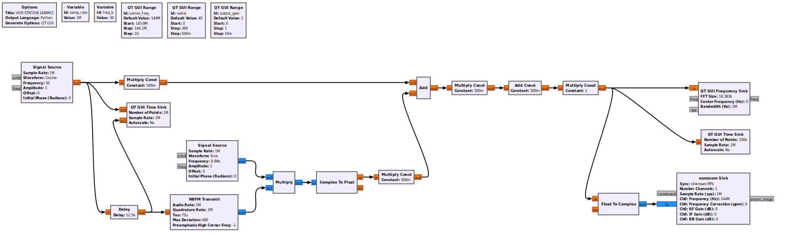
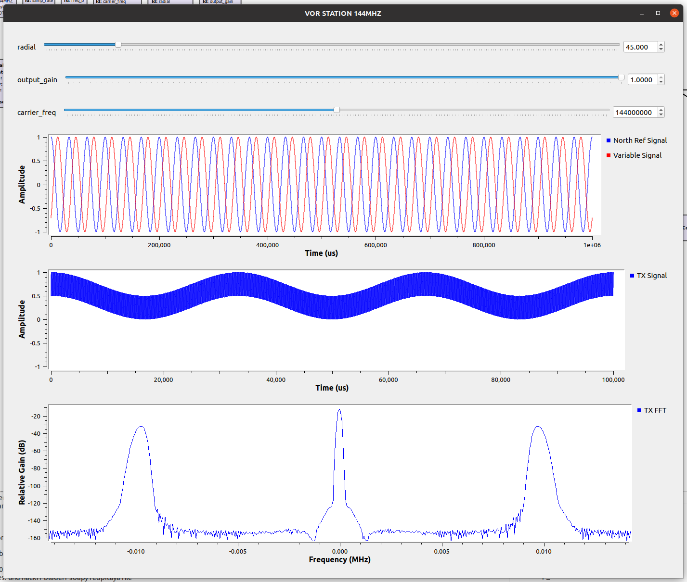

# HAB-VOR
A High Altitude Balloon which uses VOR stations to navigate

## VOR Station Simulator - 144.00

A GNU Radio based VOR Station which transmits on HAM frequencies using a HackRF.





## VOR Tracker

A slightly modified version of https://github.com/TLeconte/vortrack to allow for decoding VOR stations transmitting on HAM frequencies.

Frequency: 144.001800 MHz

Gain: 0 (when directly connecting the HackRF output to the RTL USB input via SMA cable)

Note: When using the RTL USB to track stations, the center frequency may shift due to temperature drift (wish this had a TXCO). You may need to power the RTL USB for several minutes to let it warm up, then run gqrx to find the new stable center frequency.

### Build

For rtl sdr :
```
$ make -f Makefile.rtl
```

For airspy :
> make -f Makefile.airspy


### Run
```
$ ./vortrack -g 0 144.0018
```
